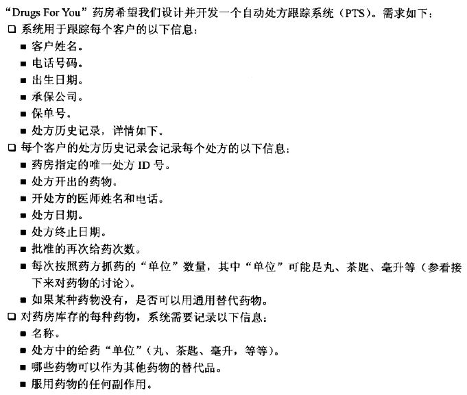
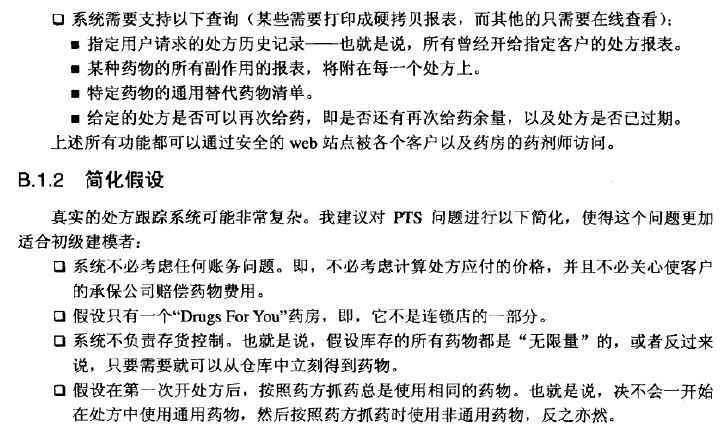
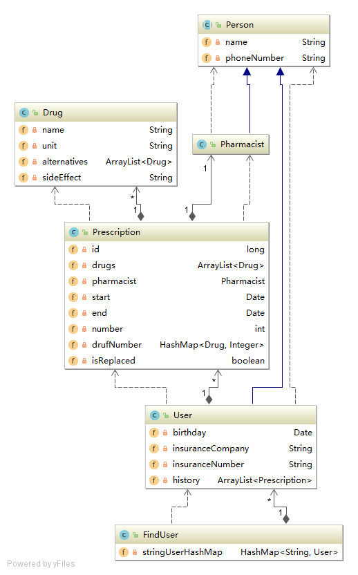
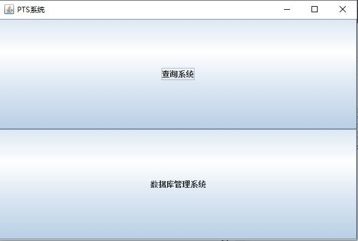
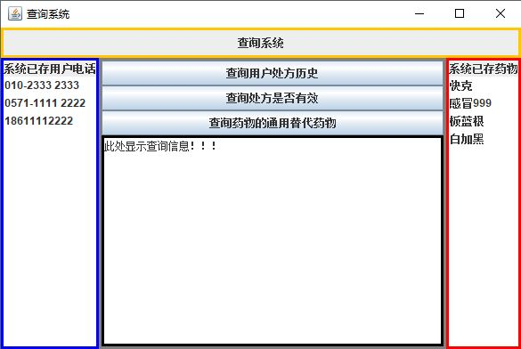
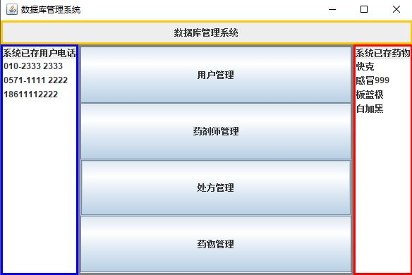

# Beginning Java Objects PTS
<h1>背景</h1>

 

<h1>包</h1>
<ul>
<li>dao数据访问层</li>
<li>pojo实体类</li>
<li>properties配置文件</li>
<li>PTS驱动器</li>
<li>service服务层</li>
<li>utils工具包</li>
<li>view表示层</li>
</ul>
<h1>类图</h1>
 

<h1>GUI使用介绍</h1>
 

 
查询系统是用来查询信息的，数据库管理系统，用来增删用户，处方，药师，药物。
 

 
这是查询系统的界面，为便于使用，已将数据所存的用户电话和药物名在两边显示出来，双击可以显示具体信息。还有三个按钮，功能如按钮所提示。
 

 
同样，双击两边列表的内容，会弹出具体信息，增加，删除内容也会在列表体现出来。四个按钮正如提示所示，增加，删除失败或成功都会有提示。