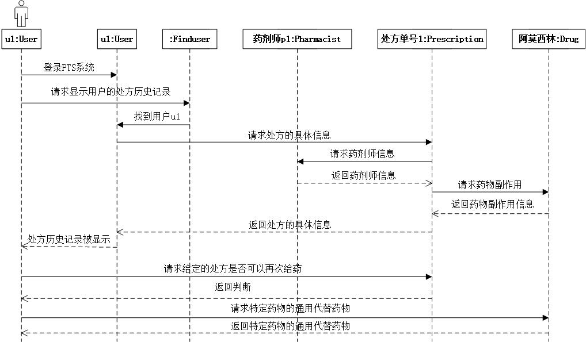

# Beginning Java Objects PTS
<h1>背景</h1>

 

<h1>类</h1>
<ul>
<li>Drug药物</li>
<li>Person</li>
<li>Pharmacist药剂师</li>
<li>Prescription处方</li>
<li>User用户</li>
<li>PTS测试“驱动器”</li>
<li>Utils“工具类”</li>
</ul>
<h1>类图</h1>
 

<h1>时序图</h1>
 
